# Streaming

A self-hosted livestream platform for conventions. It takes RTMP from the encoders in your rooms, transcodes an adaptive ladder, delivers HLS through edge servers you can add and remove during the event, and gives the video team one panel for the whole thing: programme, chat, moderation, recordings and infrastructure.

Nothing about any one convention is baked in. Names, copy, links, logo, login background and accent colour live in the database and are edited in the admin panel.

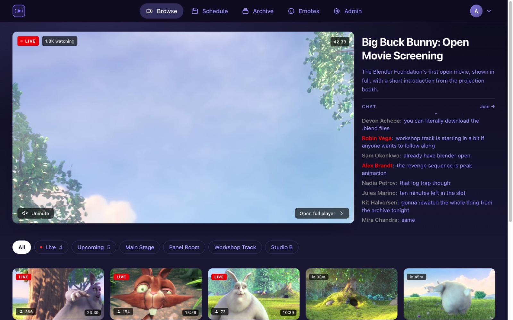

## What it does

**Watch.** A browse grid with a live hero, per-channel filters, hover previews and a programme guide. The player is HLS with a quality ladder, a seekable live window, theatre mode, a pop-out chat and an external-player link for VLC and friends. It works on a phone.

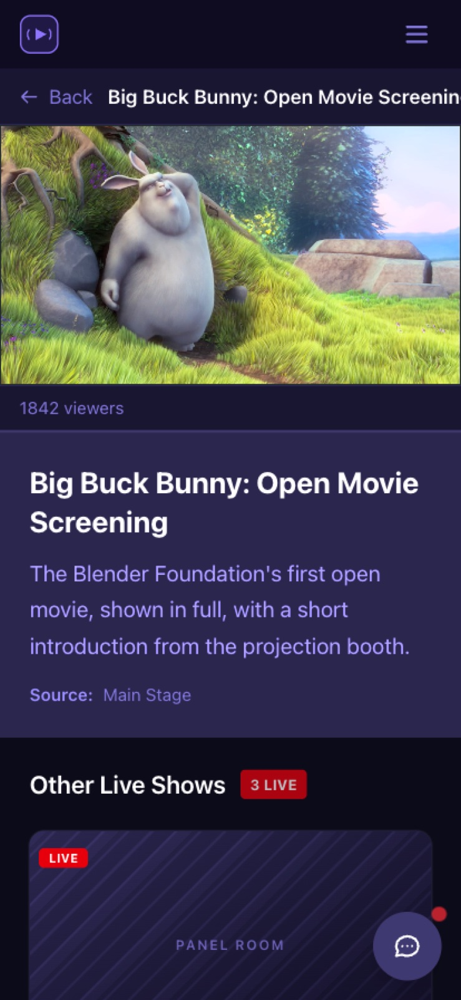


**Chat.** One channel per source, so chat survives the handover from one show to the next. Timeouts, bans, purge, clear, announcements, slow mode and per-message actions, plus chat commands for moderators. Custom emotes are uploaded by users and approved by staff.

**Programme.** Shows are planned on a drag-and-drop timeline, imported from [pretalx](docs/admin/pretalx-import.md), or created by hand. [Auto mode](docs/admin/auto-mode.md) starts a show when its source comes online and stops it at a hard stop, so nobody has to sit on the button at 2am.

**Archive.** Every source is recorded continuously to object storage. A recording is a time range over that archive, cut in a timeline editor with in and out markers, and rebuilt from the current markers whenever you move them. Published recordings are grouped by year and can require a role to watch.

**Infrastructure.** Edge servers are provisioned on Hetzner Cloud from the panel, get their DNS record, run a generated install script, and are handed viewers by the assignment job. Health checks, viewer counts, capacity and alerts sit on one dashboard.

**Access.** Guest access, password accounts and public registration are switches; sign-in providers are a list you add to. OpenID Connect against your own identity provider, or Google, GitHub and the rest through Socialite, as many at once as you like, each mapping the groups it releases to roles here. Shows and recordings can require one. See [docs/admin/authentication.md](docs/admin/authentication.md).

## Screenshots

| | |
|---|---|
| 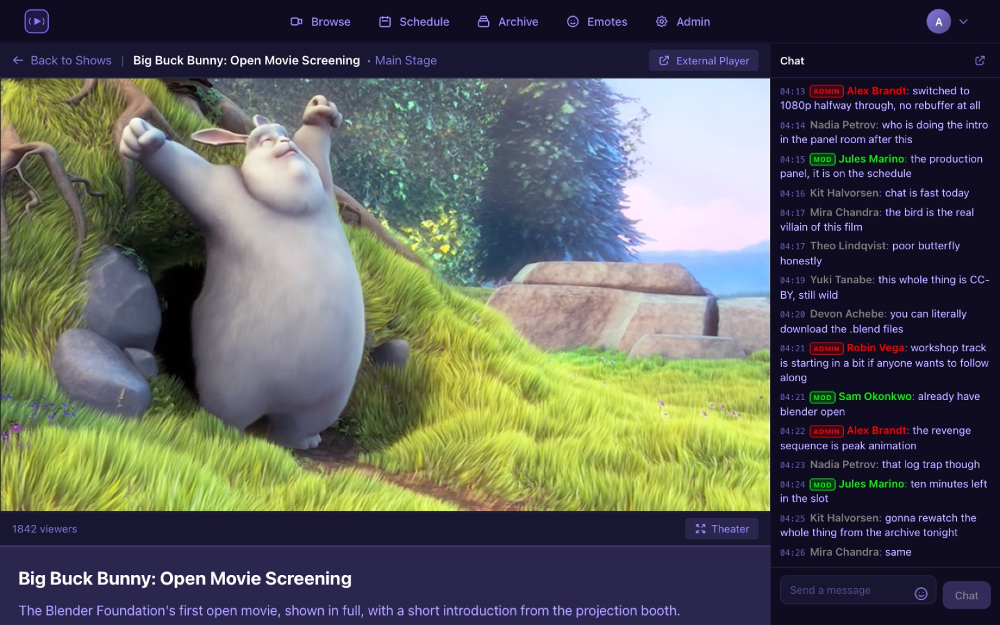 | 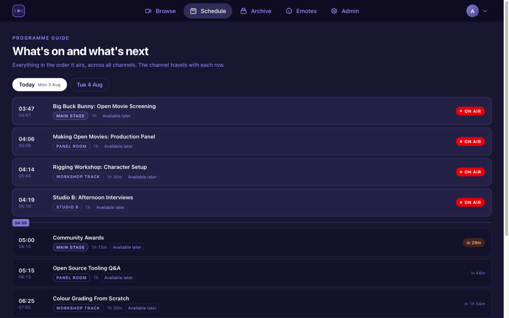 |
| Player, live chat and moderator badges | Programme guide across channels and days |
| 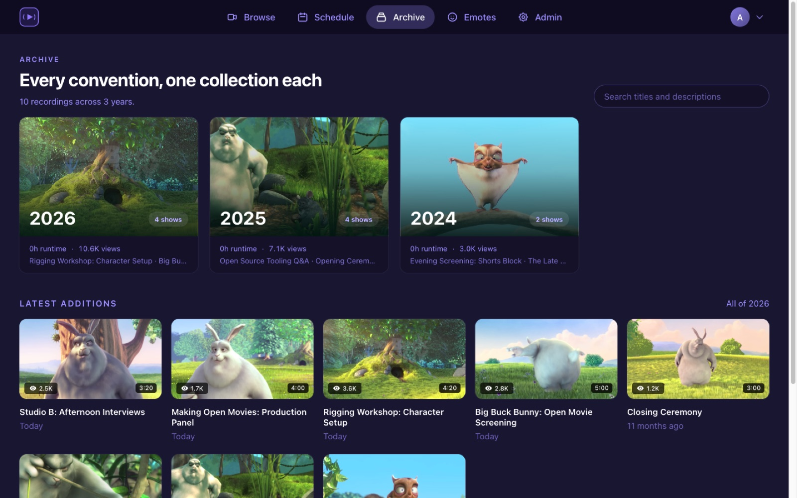 | 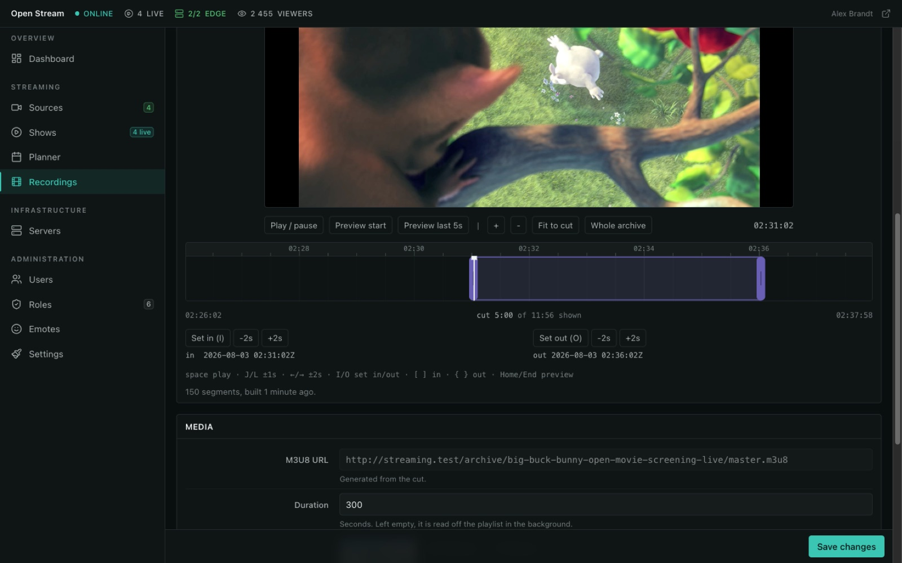 |
| Archive, one collection per year | Cutting a recording out of the continuous archive |
| 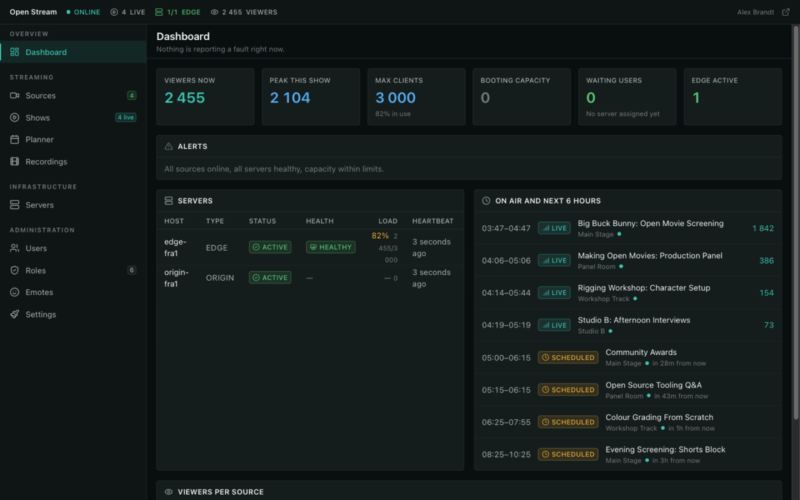 | 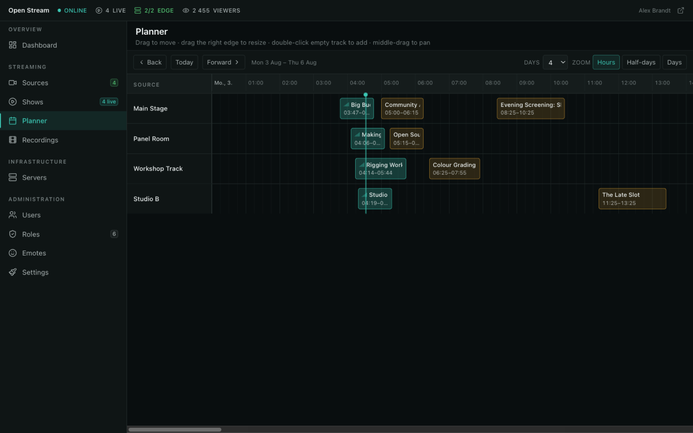 |
| Capacity, server health and what is on air | Planning the programme on a timeline |
| 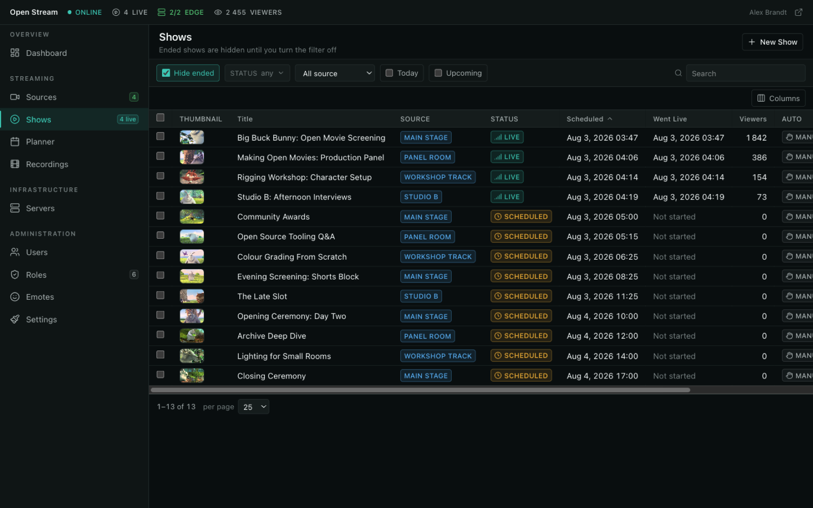 | 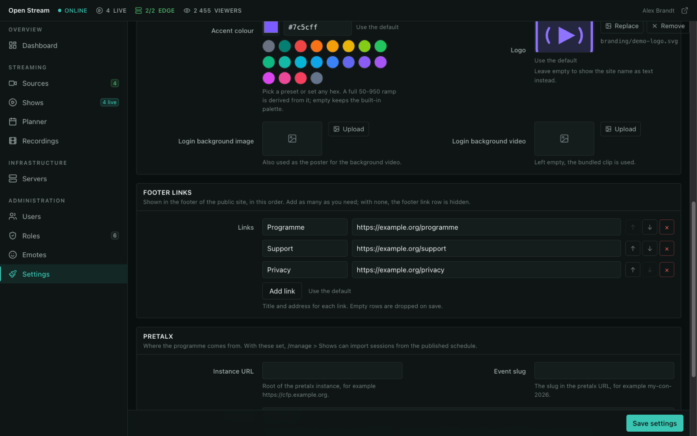 |
| Shows, with stream control per row | Branding, colours and links, applied without a rebuild |
| 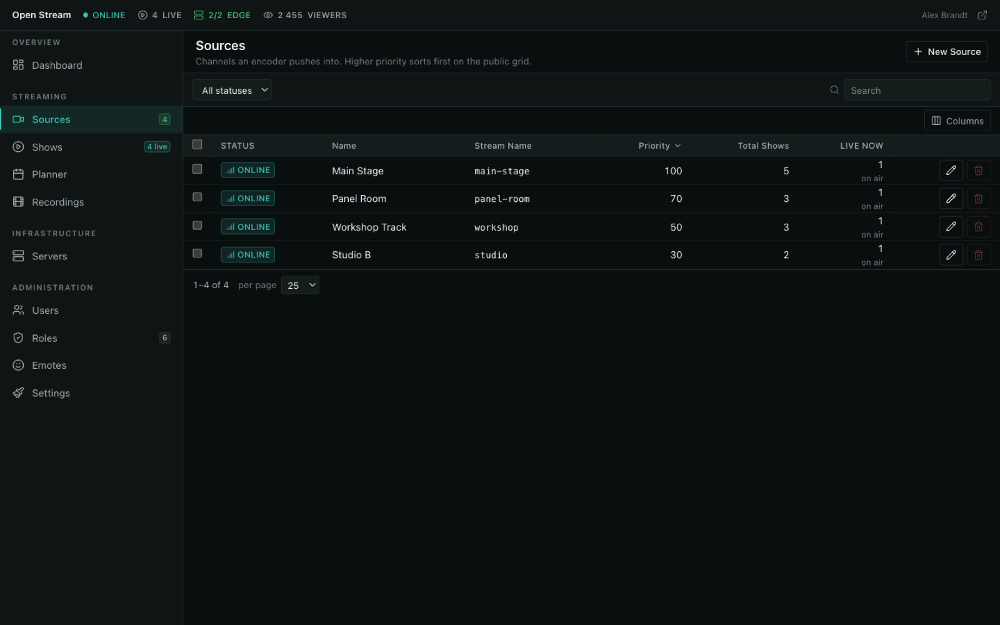 | 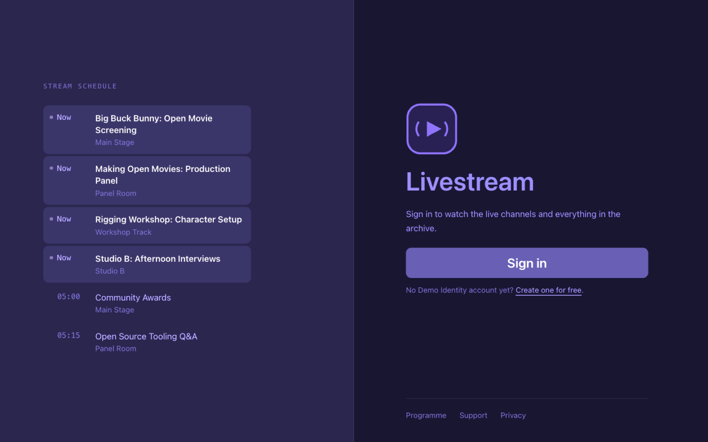 |
| Sources, one per room, each with its own stream key | Sign-in, with what is on air next to it |

The demo content in these screenshots is [Big Buck Bunny](https://peach.blender.org/) (CC BY 3.0, Blender Foundation).

## How it works

```
OBS / encoder
   |  RTMP, one stream key per source
SRS ingress ──DVR──> uploader ──> S3 ──> archive playlists ──> recordings
   |
ffmpeg ABR ladder (480p / 720p / 1080p, aligned GOPs)
   |
origin (nginx + caddy)
   |
edge servers (njs verifies playback tokens)
   |
viewers
```

The Laravel app never carries video. It hands out signed playback tokens, assigns viewers to an edge, and proxies playlists so a viewer only ever talks to its own domain. Segments come from the edges. Archive segments come from the bucket as presigned URLs, which is why a recording playlist is rendered per request rather than stored.

## Stack

Laravel 12 on PHP 8.2, Inertia 2 with Vue 3 and Tailwind 4, Vidstack and hls.js in the player, Reverb or Pusher for websockets, Horizon on Redis for queues, MySQL or PostgreSQL, S3-compatible object storage, SRS and ffmpeg for the video path, Hetzner Cloud for servers.

## Running it locally

You need PHP 8.2+, Composer, Node 20+, a database, Redis or Valkey, ffmpeg, and Docker if you want the full video path.

```bash
composer install
npm install
cp .env.example .env
php artisan key:generate
php artisan migrate --seed
npm run dev
php artisan queue:work
php artisan reverb:start
```

Video is optional for UI work, and comes in two flavours:

```bash
# fake channels written straight to disk, no Docker
php artisan db:seed --class=DevStreamChannelsSeeder
./scripts/dev-streams.sh          # then set DEV_STREAMS=true in .env

# the real path: SRS, ABR ladder, origin, edge, S3, DVR
./scripts/dev-stack.sh up
```

[docs/dev-stack.md](docs/dev-stack.md) covers both, including the switches that keep five channels running on a laptop without melting it.

## Configuration

Almost everything is edited at `/manage` > Settings and stored in the database: the convention's name and copy, the sign-in providers and modes, chat limits, the archive bucket, the playback token secrets, the container images the provisioning scripts pull. No deploy, no rebuild, no restart. See [docs/admin/settings.md](docs/admin/settings.md).

`.env` is the shipped fallback for each of those, so an existing deployment keeps working and a saved row always wins. What has to stay there is the bootstrap - app, database, cache, queue, session, Redis, log, mail, Reverb, broadcasting - plus the handful of values the local video stack's containers read out of the file directly:

| Variable | What it controls |
|---|---|
| `AWS_*` | The general bucket: emotes, thumbnails, the branding logo |
| `DVR_AWS_*` | The archive bucket. Also in /manage > Settings > Archive storage |
| `HLS_VIEWER_SECRET`, `HLS_EMBED_SECRET`, `HLS_TOKEN_LEEWAY` | Playback tokens the edges verify. Also in /manage > Settings > Tokens and keys |
| `STREAM_SYSTEM_STREAMKEY` | Shared secret between the app and the video stack. Same pane |
| `HETZNER_TOKEN`, `DNS_*` | Server provisioning and DNS records |
| `REVERB_*`, `VITE_REVERB_*` | Websockets. The `VITE_` half is baked into the bundle at build time |

For a deploy that wants to arrive already configured, the panel's write is also a command. It covers every field in every pane, not only branding:

```bash
php artisan branding:set convention_name="Example Con" primary_color="#7c5cff"
php artisan branding:set --list
```

A fresh install has nobody who can reach the panel yet, so make an administrator first:

```bash
php artisan auth:local-admin you@example.org
```

The accent colour is applied as CSS custom properties at runtime, so changing it takes effect without a rebuild.

## Deployment

The root `Dockerfile` builds the app image. `docker/` holds the images for the video path: origin SRS, origin and edge nginx and caddy, the ABR transcoder, and the DVR uploader. Queues run under Horizon, websockets under Reverb, and the scheduler needs `php artisan schedule:run` every minute.

## Documentation

- [docs/dev-stack.md](docs/dev-stack.md): the local video stack
- [docs/admin/release-checklist.md](docs/admin/release-checklist.md): the order to deploy a release in, and what to verify afterwards
- [docs/admin/settings.md](docs/admin/settings.md): what lives in the database and what stays in `.env`
- [docs/admin/authentication.md](docs/admin/authentication.md): the sign-in modes, accounts and recovery
- [docs/admin/server-credentials.md](docs/admin/server-credentials.md): how servers authenticate, and rotating their credentials
- [docs/admin/pretalx-import.md](docs/admin/pretalx-import.md): importing the programme
- [docs/admin/auto-mode.md](docs/admin/auto-mode.md): starting and stopping shows without a human
- [docs/admin/show-statistics.md](docs/admin/show-statistics.md): what the viewer numbers on a show count
- [docs/dvr-archive-plan.md](docs/dvr-archive-plan.md): how the archive and cutting work

## Contributing

Issues and pull requests are welcome. For anything larger, or for help running this at your own convention, contact @Thiritin on Telegram.

## Licence

GPL-3.0. See [LICENSE](LICENSE).
