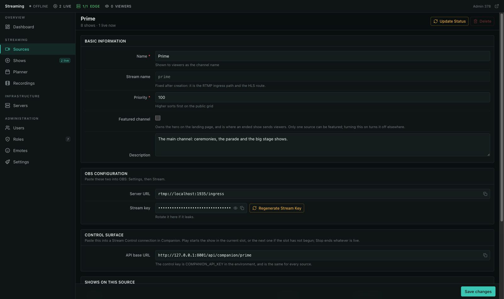
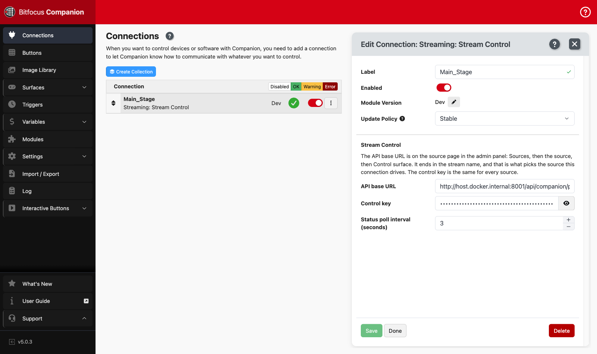
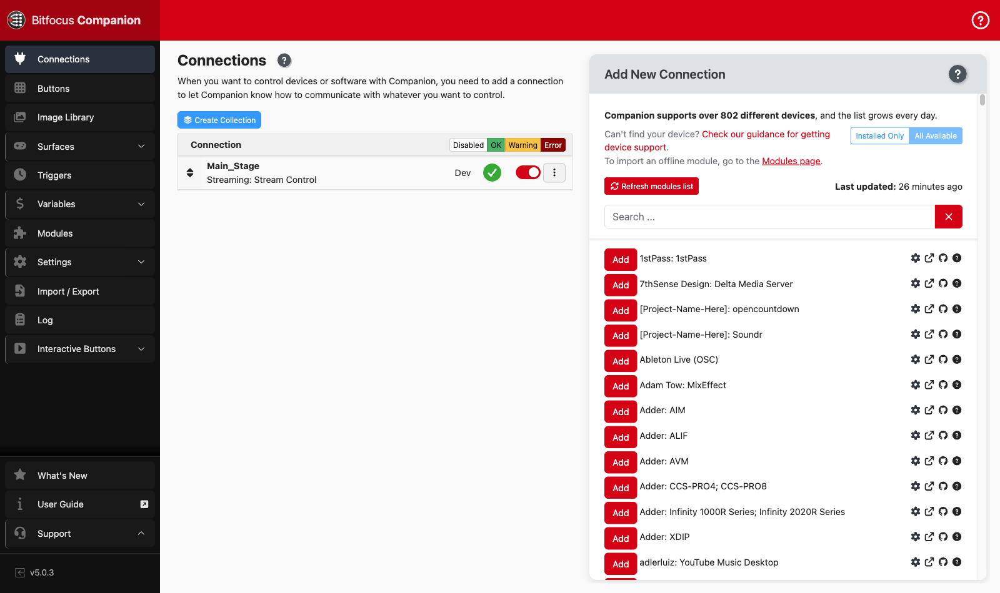
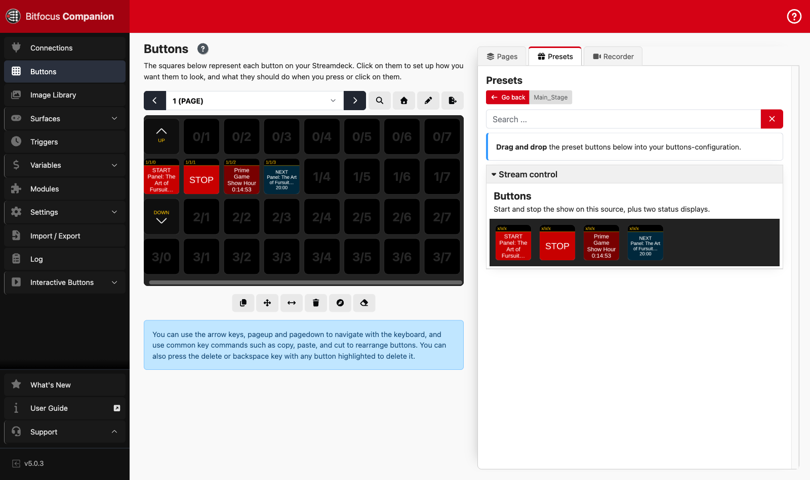
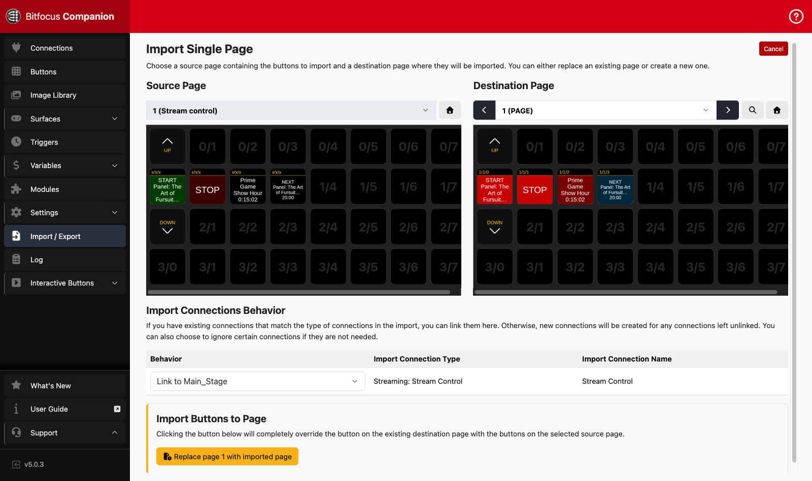

# Companion control surface

Two buttons on a Stream Deck that start and stop shows, plus a status display. Built for
the case where the person at the desk is running the room, not the admin panel.

The Play button is the whole point: it has no show picker. It starts the show whose slot is
running now, and if no slot has begun it starts the next one on the schedule.


## What it needs

- A source in `/manage` > Sources, with shows scheduled on it
- [Bitfocus Companion](https://bitfocus.io/companion) 5.x
- The `stream-control` module, from `companion/module-stream-control/` in this repo

One connection controls one source: the stream name is the last part of the API URL, and
that is what picks it. A second stage is a second connection with a different URL and the
same key, and its buttons carry their own labels because every variable is per connection.

## Setting it up

### 1. Set the control key, once per installation

```
COMPANION_API_KEY=<a long random string>
```

One key for the whole installation, not one per source. Everyone who can reach one room can
reach the others anyway, and a per-source secret would only be a second thing to rotate. An
empty key means the control API is off, which is what a fresh install has.

Rotate it by changing the value and reconfiguring the surfaces.

### 2. Copy the endpoint for the source

`/manage` > Sources > the source > **Control surface**.



The URL ends in the source's stream name, so the same key drives every stage and the URL is
what says which one this surface is on.

### 3. Install the module

Companion loads modules it did not ship with from a developer module path. Copy
`companion/module-stream-control/` onto the Companion machine and point Companion at its
parent directory (Settings, then the developer modules path), or run Companion in Docker,
where the path is already mounted:

```bash
./scripts/companion.sh up      # http://localhost:8000
```

Run `npm install --omit=dev` in the module directory first if you are not using the script,
which does it for you.

### 4. Add the connection

Connections, then search for **Stream Control**. Paste the URL from step 2 and the key from
step 1.



A green tick means the poll is getting through. Red means the URL is wrong or the app is
unreachable; the log line says which. A rejected key shows as an authentication failure
rather than a connection failure, so a typo in the key does not look like a network problem,
and a stream name that does not exist answers 404 rather than silently doing nothing.



### 5. Drop the buttons on a page

Buttons, then the Presets tab, then Stream control. Drag the four presets onto the grid.



Or import `companion/stream-control-page.companionconfig` (Import / Export, then Import
configuration) for a ready-made page. It carries no key: link it to a connection you have
already configured, or fill the URL and key in afterwards.



## The buttons

| Preset | What it does |
|---|---|
| **START** | Starts the show in the current slot, or the next scheduled show. Red while a show is live. |
| **STOP** | Ends whatever is live. |
| **Status** | Source name, live title, and how long it has been on air. |
| **Next up** | The show START would start, and its scheduled time. |

Both actions are idempotent, because a control surface gets leaned on: pressing Start while
a show is live does nothing, and pressing Stop with nothing live does nothing. Neither
double-starts a show nor lights the button up in error.

Pressing Start when nothing is queued is the one refusal, and it is logged in Companion with
the reason.

## Which show Start picks

In order:

1. A **scheduled** show on this source whose slot contains right now.
2. Otherwise the **next scheduled** show, however far out.

A scheduled show whose slot has already ended is skipped. It was missed, and starting it
would put the wrong title on air, so rule 2 moves past it. Shows on other sources are never
touched.

Pressing Start early is allowed on purpose: "we are ready, go" is a normal thing to want,
and the show goes live with `actual_start` stamped at the press, not at the scheduled time.

This is the same path as the Go Live button in `/manage` (`Show::goLive()` and
`Show::endLivestream()`), so viewer notifications, timestamps and recordings behave
identically whichever one is used. It is independent of [auto mode](auto-mode.md): a show
with auto mode on can still be started by hand from the surface, and the auto-mode hard stop
still applies to it.

## Variables

Every variable is prefixed with the connection label, e.g. `$(stream-control:live_title)`.

| Variable | Example |
|---|---|
| `source_name`, `source_status` | `Prime`, `online` |
| `live` | `yes` / `no` |
| `live_title`, `live_since`, `live_elapsed` | `Fursuit Parade`, `14:03`, `1:01:05` |
| `next_title`, `next_start`, `next_in` | `Game Show Hour`, `17:00`, `2:55:00` |
| `live_title_short`, `next_title_short` | the same titles cut to fit a key |
| `next_action` | `start_current`, `start_next` or `none` |
| `viewers` | `412` |
| `last_message` | the last reply from the server |

Clock times are formatted by the app in the event's timezone and printed as they arrive. A
Companion box running UTC, which is what the Docker image does, still shows the schedule the
rest of the system is working to.

Programme titles are written for a schedule page - "Panel: The Art of Fursuit Construction,
Part Two" is a normal one - and a 72px key cannot hold one. The presets print the `_short`
form, cut on a word boundary by the server; the full title stays in `live_title` and
`next_title` for a wider display or a trigger.

## The API behind it

Three endpoints, authenticated with the installation's control key in `X-Companion-Token` (a
`token` query parameter also works, for surfaces that cannot set headers). The source is the
stream name in the path. Rate limited to 120 requests a minute, which is a 0.5s poll with
room to spare.

```
GET  /api/companion/{stream-name}/status
POST /api/companion/{stream-name}/start
POST /api/companion/{stream-name}/stop
```

All three answer with the same status block, so an action updates the surface without
waiting for the next poll:

```json
{
  "ok": true,
  "action": "started_next",
  "message": "'Game Show Hour' is now live.",
  "source": { "id": 1, "name": "Prime", "slug": "prime", "status": "online" },
  "live": true,
  "live_show": { "id": 12, "title": "Game Show Hour", "title_short": "Game Show Hour", "actual_start_clock": "17:00", "...": "..." },
  "next_show": { "id": 13, "title": "Evening Feature", "title_short": "Evening Feature", "scheduled_start_clock": "20:00", "...": "..." },
  "next_action": "none",
  "viewer_count": 412,
  "server_time": "2026-08-17T17:00:10+02:00"
}
```

Status codes: `200` for anything that worked, including the no-ops; `409` for a Start with
nothing queued; `404` for an unknown stream name; `401` for a bad or unset key. Only `409`,
`404` and `401` are errors, and the module keeps the connection green on a `409` because the
schedule, not the link, is what is empty.

This is a plain HTTP API, so anything else that can send a request - a stream deck running
Companion's Generic HTTP module, a bash script, a physical button on a Pi - can drive it
with the same key.

## Local testing

```bash
./scripts/companion.sh up      # Companion at http://localhost:8000
./scripts/companion.sh logs    # follow it
./scripts/companion.sh reload  # after editing the module
./scripts/companion.sh down
```

The module is mounted from the repo into `/app/module-local-dev/stream-control`, so an edit
plus a connection restart is the whole loop. The container reaches the app on
`streaming.test` through `host-gateway`; if the app is on a different host or port, point
the connection's base URL at that instead.

## Where it lives

| Piece | File |
|---|---|
| Which show Start and Stop apply to | `app/Services/ShowControlService.php` |
| The endpoints | `app/Http/Controllers/Api/CompanionController.php` |
| Key check | `app/Http/Middleware/CheckCompanionTokenMiddleware.php` |
| The key itself | `COMPANION_API_KEY`, read in `config/stream.php` |
| The Companion module | `companion/module-stream-control/` |
| Ready-made button page | `companion/stream-control-page.companionconfig` |
| Companion in Docker | `docker-compose.companion.yml`, `scripts/companion.sh` |
| Tests | `tests/Feature/Api/CompanionControlTest.php`, `companion/module-stream-control/test/` |
